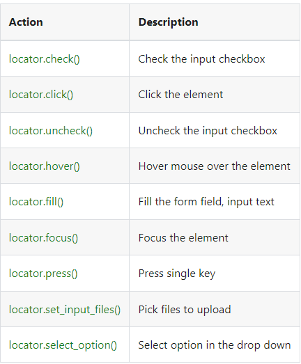

### Lab: Writing tests

Playwright tests are simple, they

- **perform actions**, and
- **assert the state** against expectations.

There is no need to wait for anything prior to performing an action: Playwright automatically waits for the wide range of actionability checks to pass prior to performing each action.

There is also no need to deal with the race conditions when performing the checks - Playwright assertions are designed in a way that they describe the expectations that need to be eventually met.

That's it! These design choices allow Playwright users to forget about flaky timeouts and racy checks in their tests altogether.

**You will learn**

- How to write the first test
- How to perform actions
- How to use assertions
- How tests run in isolation
- How to use test hooks

#### First test

Take a look at the following example to see how to write a test. Note how the file name follows the `test_` prefix convention as well as each test name.

Create a file with following code: `test_example.py`

```
import re
from playwright.sync_api import Page, expect

def test_has_title(page: Page):
    page.goto("https://playwright.dev/")

    # Expect a title "to contain" a substring.
    expect(page).to_have_title(re.compile("Playwright"))

def test_get_started_link(page: Page):
    page.goto("https://playwright.dev/")

    # Click the get started link.
    page.get_by_role("link", name="Get started").click()

    # Expects page to have a heading with the name of Installation.
    expect(page.get_by_role("heading", name="Installation")).to_be_visible()
```

### Actions

**Navigation**

Most of the tests will start with navigating page to the URL. After that, test will be able to interact with the page elements.

`page.goto("https://playwright.dev/")`

Playwright will wait for page to reach the load state prior to moving forward. Learn more about the page.goto() options.

#### Interactions

Performing actions starts with locating the elements. Playwright uses Locators API for that. Locators represent a way to find element(s) on the page at any moment, learn more about the different types of locators available. Playwright will wait for the element to be actionable prior to performing the action, so there is no need to wait for it to become available.

```
# Create a locator.
get_started = page.get_by_role("link", name="Get started")

# Click it.
get_started.click()
```

In most cases, it'll be written in one line:

`page.get_by_role("link", name="Get started").click()`

#### Basic actions

This is the list of the most popular Playwright actions. Note that there are many more, so make sure to check the Locator API section to learn more about them.



#### Assertions

Playwright includes assertions that will wait until the expected condition is met. Using these assertions allows making the tests non-flaky and resilient. For example, this code will wait until the page gets the title containing "Playwright":

```
import re
from playwright.sync_api import expect

expect(page).to_have_title(re.compile("Playwright"))
```

Here is the list of the most popular async assertions. Note that there are many more to get familiar with:


#### Test isolation

The Playwright Pytest plugin is based on the concept of test fixtures such as the built in page fixture, which is passed into your test. Pages are isolated between tests due to the Browser Context, which is equivalent to a brand new browser profile, where every test gets a fresh environment, even when multiple tests run in a single Browser.

Create a file with following code: `test_example.py`

```
from playwright.sync_api import Page

def test_example_test(page: Page):
  pass
  # "page" belongs to an isolated BrowserContext, created for this specific test.

def test_another_test(page: Page):
  pass
  # "page" in this second test is completely isolated from the first test.
```

#### Using fixtures

You can use various fixtures to execute code before or after your tests and to share objects between them. A function scoped fixture e.g. with autouse behaves like a beforeEach/afterEach. And a module scoped fixture with autouse behaves like a beforeAll/afterAll which runs before all and after all the tests.

Create a file with following code: `test_example.py`

```
import pytest
from playwright.sync_api import Page, expect

@pytest.fixture(scope="function", autouse=True)
def before_each_after_each(page: Page):
    
    print("before the test runs")

    # Go to the starting url before each test.
    page.goto("https://playwright.dev/")
    yield
    
    print("after the test runs")

def test_main_navigation(page: Page):
    # Assertions use the expect API.
    expect(page).to_have_url("https://playwright.dev/")
```
