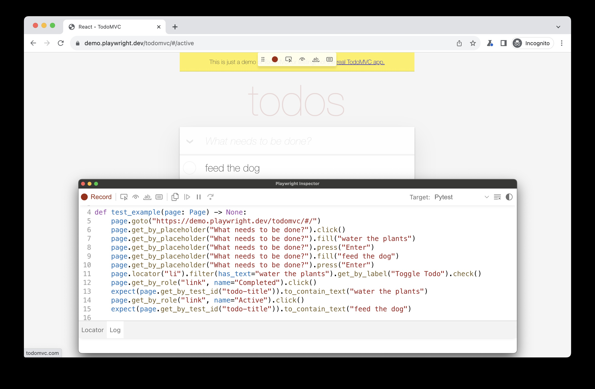
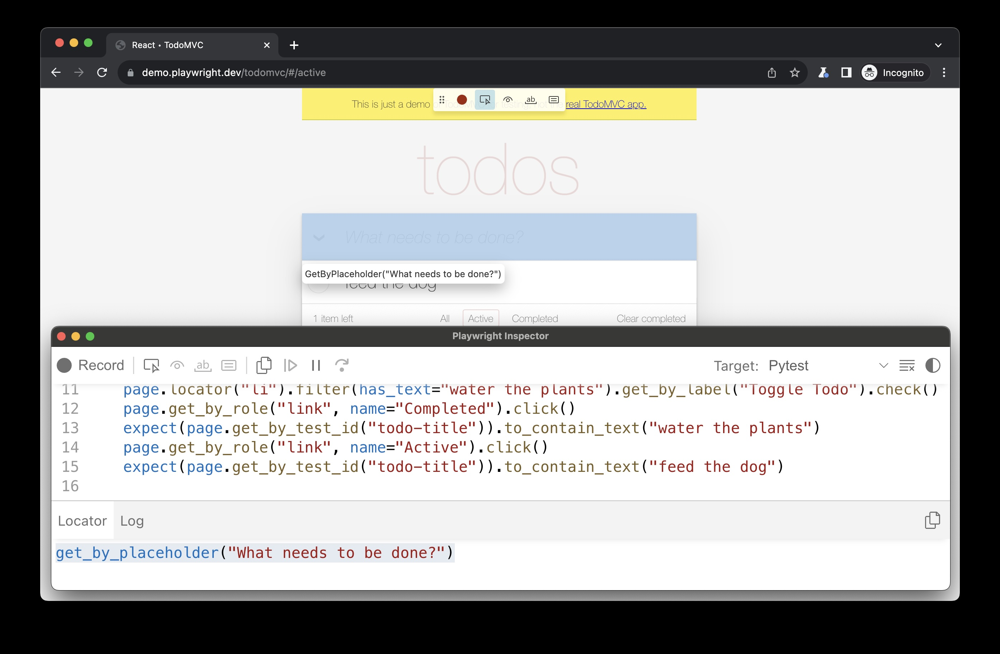

### Lab: Generating tests

Playwright comes with the ability to generate tests out of the box and is a great way to quickly get started with testing. It will open two windows, a browser window where you interact with the website you wish to test and the Playwright Inspector window where you can record your tests, copy the tests, clear your tests as well as change the language of your tests.

You will learn

- How to record a test
- How to generate locators

#### Running Codegen

Use the codegen command to run the test generator followed by the URL of the website you want to generate tests for. The URL is optional and you can always run the command without it and then add the URL directly into the browser window instead.

`playwright codegen demo.playwright.dev/todomvc`

#### Recording a test

Run `codegen` and perform actions in the browser. Playwright will generate the code for the user interactions. Codegen will look at the rendered page and figure out the recommended locator, prioritizing role, text and test id locators. If the generator identifies multiple elements matching the locator, it will improve the locator to make it resilient and uniquely identify the target element, therefore eliminating and reducing test(s) failing and flaking due to locators.

With the test generator you can record:

Actions like click or fill by simply interacting with the page
Assertions by clicking on one of the icons in the toolbar and then clicking on an element on the page to assert against. You can choose:

- `'assert visibility'` to assert that an element is visible
- `'assert text'` to assert that an element contains specific text
- `'assert value'` to assert that an element has a specific value

When you have finished interacting with the page, press the 'record' button to stop the recording and use the 'copy' button to copy the generated code to your editor.

Use the `'clear'` button to clear the code to start recording again. Once finished close the Playwright inspector window or stop the terminal command.

#### Generating locators

You can generate locators with the test generator.

- Press the `'Record'` button to stop the recording and the `'Pick Locator'` button will appear.
- Click on the `'Pick Locator'` button and then hover over elements in the browser window to see the locator highlighted underneath each element.
- To choose a locator click on the element you would like to locate and the code for that locator will appear in the locator playground next to the Pick Locator button.
- You can then edit the locator in the locator playground to fine tune it and see the matching element highlighted in the browser window.
- Use the copy button to copy the locator and paste it into your code.

