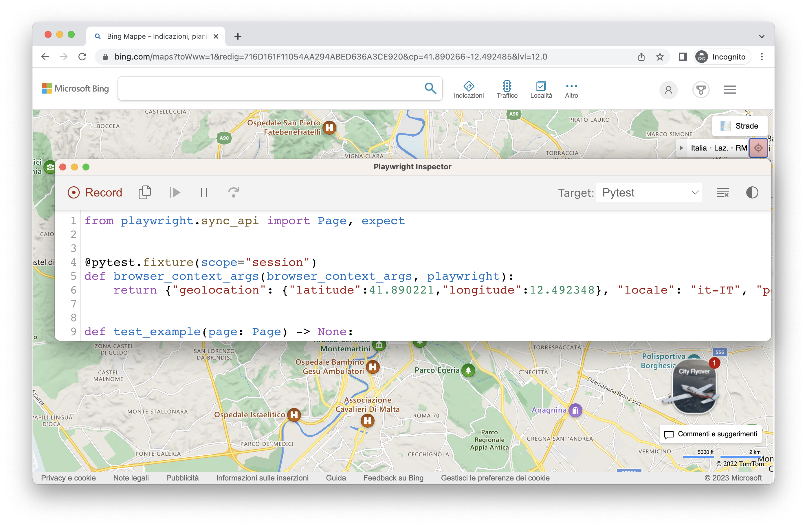

### Lab: Emulation

You can use the test generator to generate tests using emulation so as to generate a test for a specific viewport, device, color scheme, as well as emulate the geolocation, language or timezone. The test generator can also generate a test while preserving authenticated state.

#### Emulate viewport size

Playwright opens a browser window with its viewport set to a specific width and height and is not responsive as tests need to be run under the same conditions. Use the --viewport option to generate tests with a different viewport size.

`playwright codegen --viewport-size=800,600 playwright.dev`

#### Emulate devices

Record scripts and tests while emulating a mobile device using the --device option which sets the viewport size and user agent among others.

`playwright codegen --device="iPhone 13" playwright.dev`

#### Emulate color scheme

Record scripts and tests while emulating the color scheme with the `--color-scheme` option.

`playwright codegen --color-scheme=dark playwright.dev`

#### Emulate geolocation, language and timezone

Record scripts and tests while emulating timezone, language & location using the --timezone, --geolocation and --lang options. Once the page opens:

1. Accept the cookies
2. On the top right click on the locate me button to see geolocation in action.

`playwright codegen --timezone="Europe/Rome" --geolocation="41.890221,12.492348" --lang="it-IT" bing.com/maps`

#### Preserve authenticated state

Run codegen with `--save-storage` to save cookies and localStorage at the end of the session. This is useful to separately record an authentication step and reuse it later when recording more tests.

`playwright codegen github.com/microsoft/playwright --save-storage=auth.json`

#### Login

After performing authentication and closing the browser, auth.json will contain the storage state which you can then reuse in your tests.

Make sure you only use the auth.json locally as it contains sensitive information. Add it to your .gitignore or delete it once you have finished generating your tests.

**Load authenticated state**

Run with `--load-storage` to consume the previously loaded storage from the auth.json. This way, all cookies and localStorage will be restored, bringing most web apps to the authenticated state without the need to login again. This means you can can continue generating tests from the logged in state.

`playwright codegen --load-storage=auth.json github.com/microsoft/playwright`

