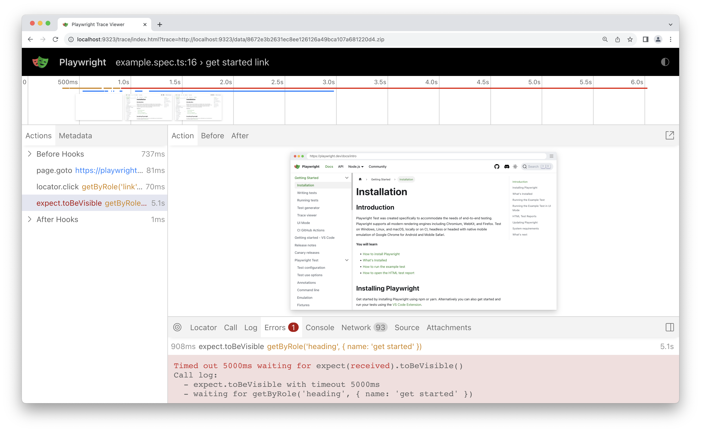

### Lab: Trace viewer

Playwright Trace Viewer is a GUI tool that lets you explore recorded Playwright traces of your tests meaning you can go back and forward though each action of your test and visually see what was happening during each action.

You will learn

- How to record a trace
- How to open the HTML report
- How to open the trace viewer

#### Recording a trace

Create a file with following code: `test_example.py`

```
import pytest
from playwright.sync_api import Page, expect

@pytest.fixture(scope="function", autouse=True)
def before_each_after_each(page: Page):
    
    print("before the test runs")

    # Go to the starting url before each test.
    page.goto("https://playwright.dev/")
    yield
    
    print("after the test runs")

def test_main_navigation(page: Page):
    # Assertions use the expect API.
    expect(page).to_have_url("https://playwright.dev/")
```

Traces can be recorded by running your tests with the --tracing flag.

`pytest --tracing on`

Options for tracing are:

- `on`: Record trace for each test
- `off`: Do not record trace. (default)
- `retain-on-failure`: Record trace for each test, but remove all traces from successful test runs.

This will record the trace and place it into the file named trace.zip in your test-results directory.

#### Opening the trace

You can open the saved trace using the Playwright CLI or in your browser on `trace.playwright.dev`. Make sure to add the full path to where your t/tr   race.zip file is located. This should include the test-results directory followed by the test name and then trace.zip.

`playwright show-trace UPDATE_PATH\trace.zip`


#### Viewing the trace

View traces of your test by clicking through each action or hovering using the timeline and see the state of the page before and after the action. Inspect the log, source and network during each step of the test. The trace viewer creates a DOM snapshot so you can fully interact with it, open devtools etc.


