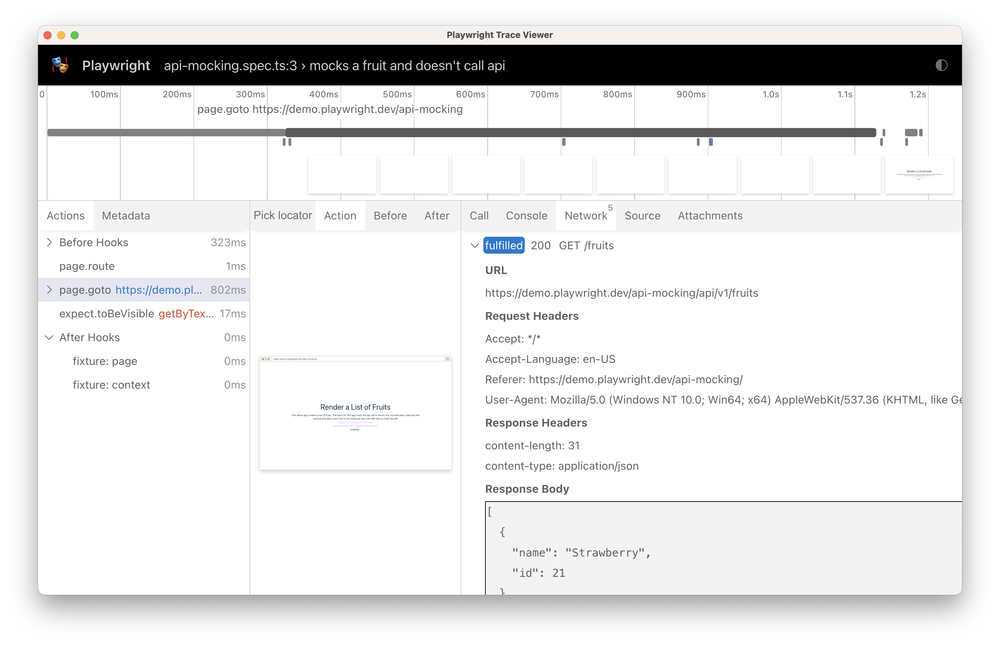
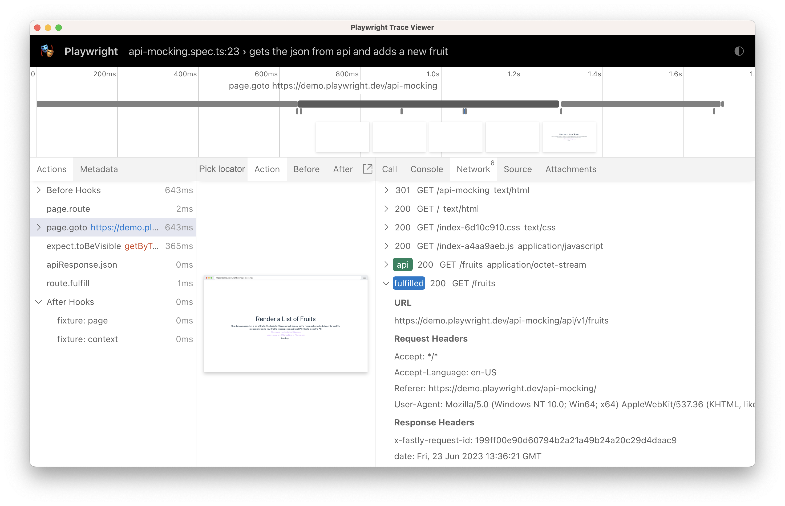
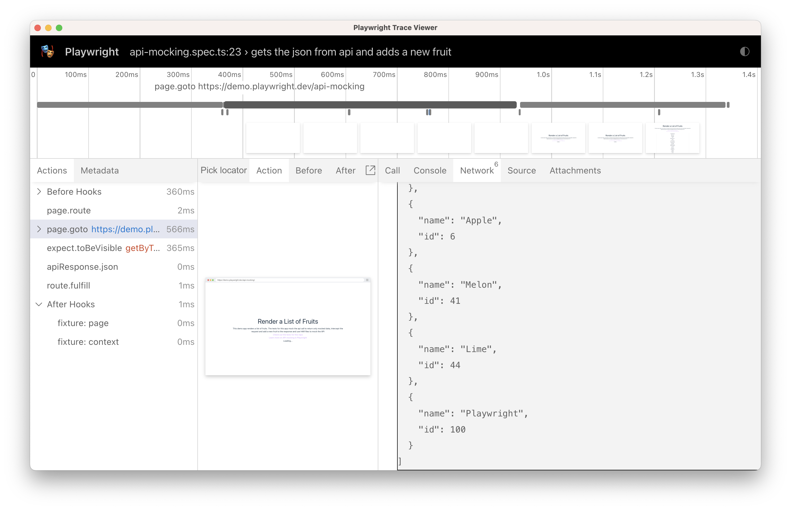

### Lab: Mock APIs

Web APIs are usually implemented as HTTP endpoints. Playwright provides APIs to mock and modify network traffic, both HTTP and HTTPS. Any requests that a page does, including XHRs and fetch requests, can be tracked, modified and mocked. With Playwright you can also mock using HAR files that contain multiple network requests made by the page.

#### Mock API requests

The following code will intercept all the calls to */**/api/v1/fruits and will return a custom response instead. No requests to the API will be made. The test goes to the URL that uses the mocked route and asserts that mock data is present on the page.

Create/Edit a file with following code: `test_example.py`

```
import pytest
from playwright.sync_api import Page, Route, expect

def test_mock_the_fruit_api(page: Page):
    def handle(route: Route):
        json = [{"name": "Strawberry", "id": 21}]
        # fulfill the route with the mock data
        route.fulfill(json=json)

    # Intercept the route to the fruit API
    page.route("*/**/api/v1/fruits", handle)

    # Go to the page
    page.goto("https://demo.playwright.dev/api-mocking")

    # Assert that the Strawberry fruit is visible
    expect(page.get_by_text("Strawberry")).to_be_visible()
```

Traces can be recorded by running your tests with the `--tracing` flag.

**Note:** Delete the `test-results` folder before running below commands.

`pytest --tracing on`

`playwright show-trace UPDATE_PATH\trace.zip`

You can see from the trace of the example test that the API was never called, it was however fulfilled with the mock data.



#### Modify API responses

Sometimes, it is essential to make an API request, but the response needs to be patched to allow for reproducible testing. In that case, instead of mocking the request, one can perform the request and fulfill it with the modified response.

In the example below we intercept the call to the fruit API and add a new fruit called 'playwright', to the data. We then go to the url and assert that this data is there:

Create/Edit a file with following code: `test_example.py`

```
import pytest
from playwright.sync_api import Page, Route, expect

def test_gets_the_json_from_api_and_adds_a_new_fruit(page: Page):
    def handle(route: Route):
        response = route.fetch()
        json = response.json()
        json.append({ "name": "Loquat", "id": 100})
        # Fulfill using the original response, while patching the response body
        # with the given JSON object.
        route.fulfill(response=response, json=json)

    page.route("https://demo.playwright.dev/api-mocking/api/v1/fruits", handle)

    # Go to the page
    page.goto("https://demo.playwright.dev/api-mocking")

    # Assert that the new fruit is visible
    expect(page.get_by_text("Loquat", exact=True)).to_be_visible()
```

Traces can be recorded by running your tests with the --tracing flag.

**Note:** Delete the `test-results` folder before running below commands.

`pytest --tracing on`

`playwright show-trace UPDATE_PATH\trace.zip`

In the trace of our test we can see that the API was called and the response was modified.



By inspecting the response we can see that our new fruit was added to the list. 


